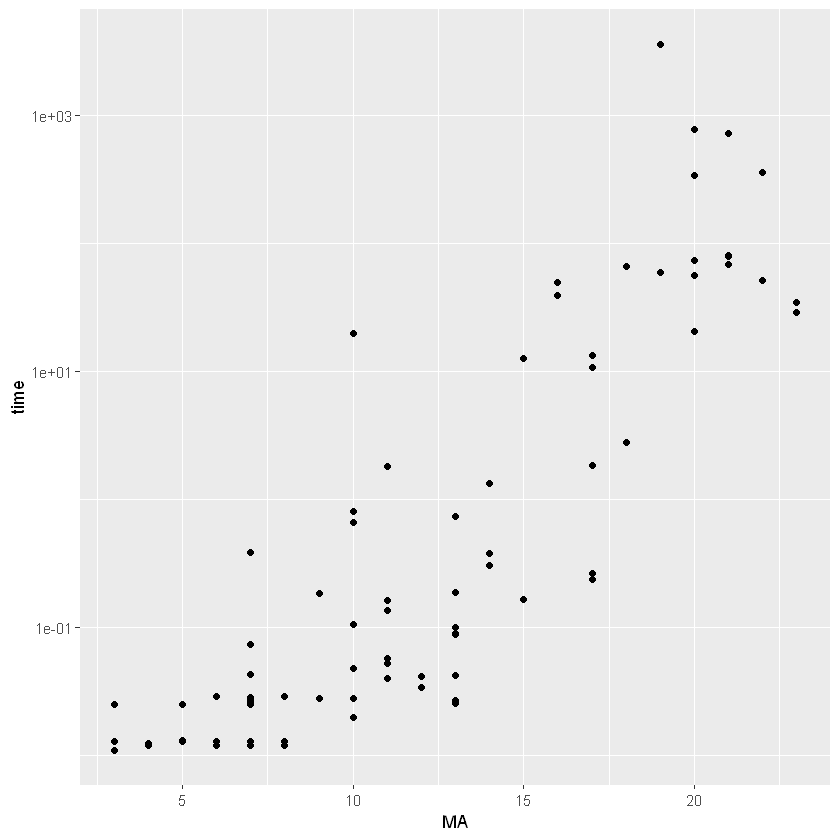
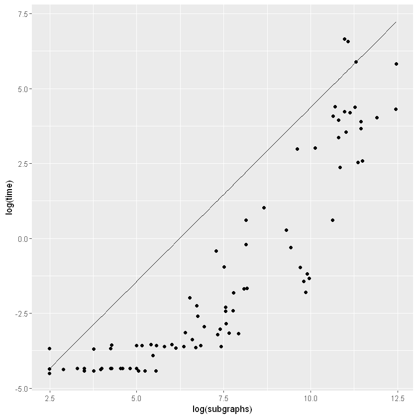
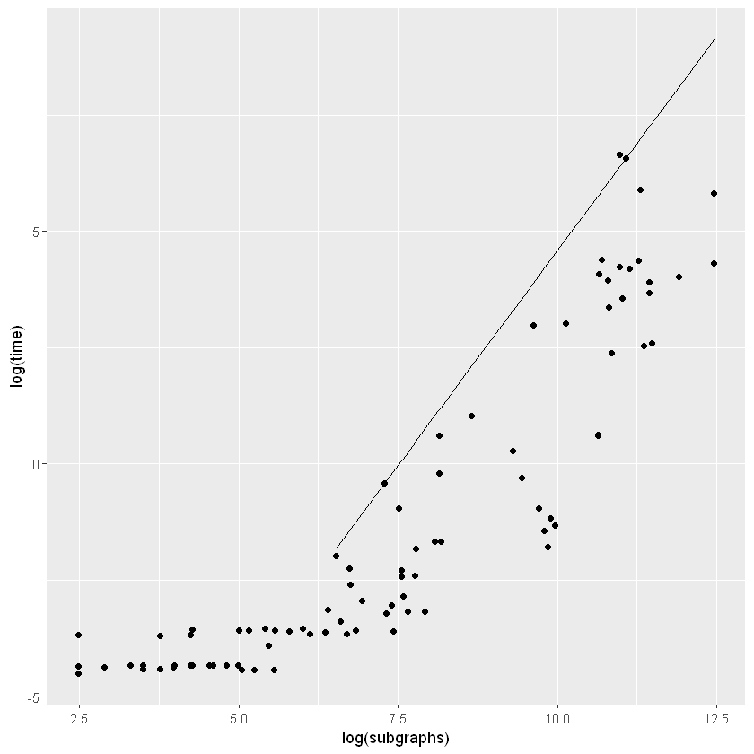
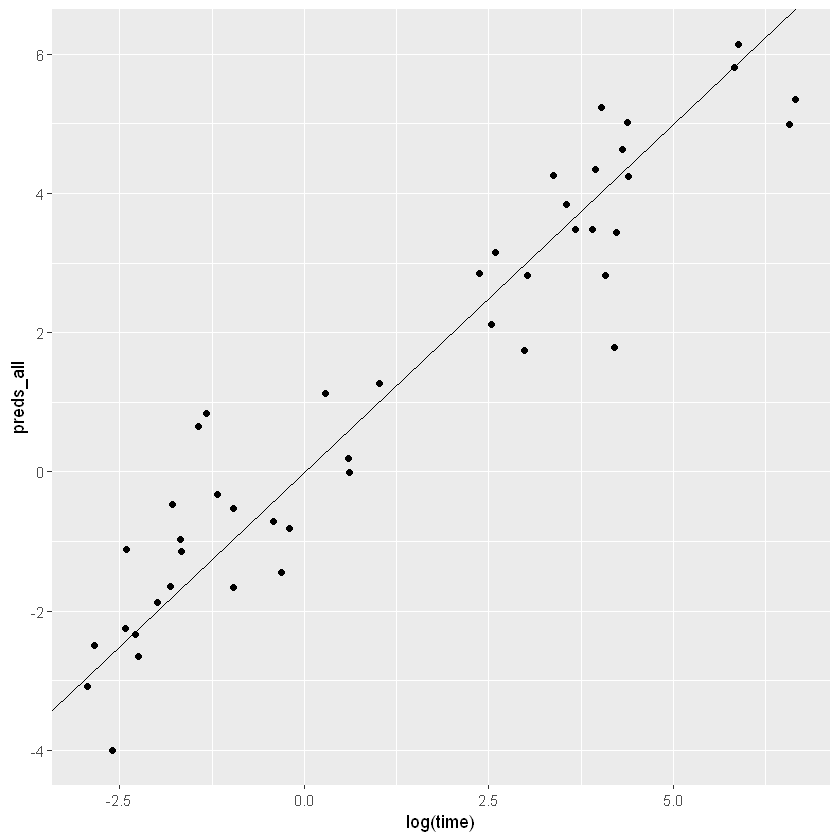
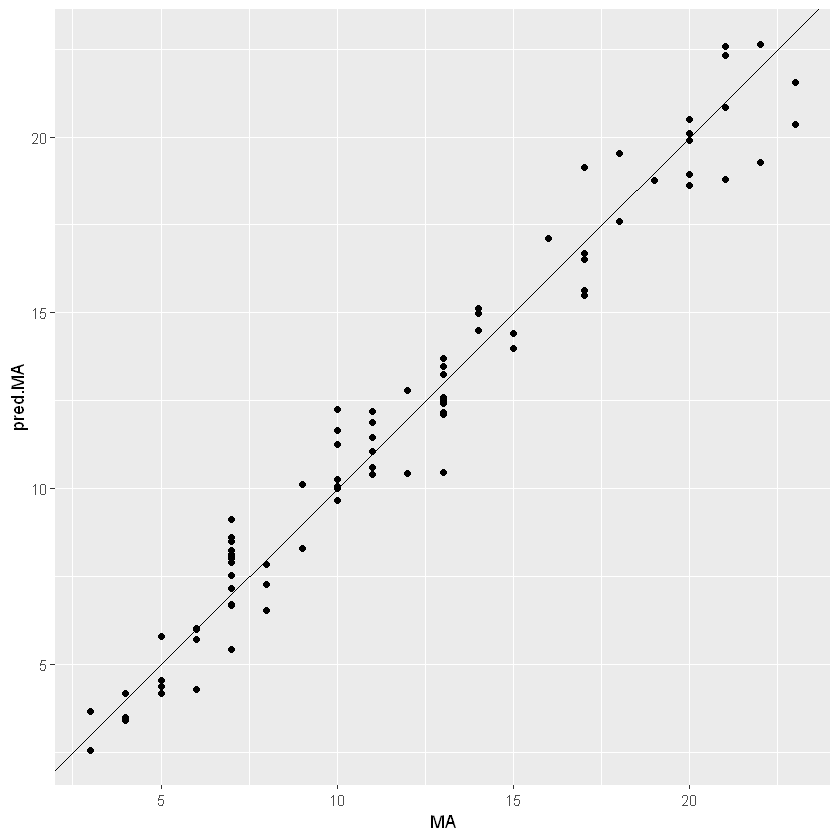

```R
library(tidyverse)
library(quantreg)
```

# Explore data
We've got a combination of MA, time, InChI, Number of Subgraphs, Number of Unique Bonds, and Number of Carbon Atoms


```R
go_times <- read.csv("Exact_Go_subgraphs_bonds_carbon.csv")
```


```R
q <- ggplot(go_times, aes(x = MA, y = time)) + geom_point() + scale_y_log10()
q
```

    Warning message:
    "Removed 17 rows containing missing values (geom_point)."
    


    

    


Somehow there's a time that's greater than 1000 s which shouldn't be in this dataset 


```R
clean_go_times <- go_times[go_times$time < 1000,]
```

Let's check out some quantile regression. I'm trying to predict a time thats greater than 95% of the time required just using subgraphs


```R
rq.model <- rq(log(time) ~ log(subgraphs), tau = 0.95, data = clean_go_times)
```


```R
clean_go_times$preds <- predict(rq.model)
```

It looks like there's a base-line time required to move between the python/C/Go. Let's ignore those times and refit


```R
ggplot(clean_go_times) + geom_point(aes(x = log(subgraphs), y = log(time))) +
    geom_line(aes(x = log(subgraphs), y = preds))
```


    

    


```R
clean_go_times_2 = clean_go_times[clean_go_times$time > 0.05,]
rq.model2 <- rq(log(time) ~ log(subgraphs), tau = 0.95, data = clean_go_times_2)
clean_go_times_2$preds <- predict(rq.model2)
ggplot(clean_go_times_2) + geom_point(aes(x = log(subgraphs), y = log(time)), data = clean_go_times) +
    geom_line(aes(x = log(subgraphs), y = preds))
```


    

    


```R
summary(rq.model2)
```


    
    Call: rq(formula = log(time) ~ log(subgraphs), tau = 0.95, data = clean_go_times_2)
    
    tau: [1] 0.95
    
    Coefficients:
                   coefficients lower bd  upper bd 
    (Intercept)    -13.87341    -14.57513  16.36395
    log(subgraphs)   1.84609     -0.37338   1.92483


# Lets see how the model fits if we use all three predictors. Switch back to GLM


```R
all_model <- glm(log(time) ~ log(subgraphs) + 
                             n_unique_bonds + 
                             n_carbon, 
                 data = clean_go_times_2) 
```


```R
summary(all_model)
```


    
    Call:
    glm(formula = log(time) ~ log(subgraphs) + n_unique_bonds + n_carbon, 
        data = clean_go_times_2)
    
    Deviance Residuals: 
         Min        1Q    Median        3Q       Max  
    -2.16615  -0.50860  -0.05089   0.56173   2.41325  
    
    Coefficients:
                    Estimate Std. Error t value Pr(>|t|)    
    (Intercept)    -16.89935    0.98185 -17.212  < 2e-16 ***
    log(subgraphs)   1.05101    0.11801   8.906 3.17e-11 ***
    n_unique_bonds   0.09161    0.07740   1.184    0.243    
    n_carbon         0.54396    0.06300   8.635 7.41e-11 ***
    ---
    Signif. codes:  0 '***' 0.001 '**' 0.01 '*' 0.05 '.' 0.1 ' ' 1
    
    (Dispersion parameter for gaussian family taken to be 0.9127754)
    
        Null deviance: 389.086  on 45  degrees of freedom
    Residual deviance:  38.337  on 42  degrees of freedom
    AIC: 132.16
    
    Number of Fisher Scoring iterations: 2
    


```R
clean_go_times_2$preds_all = predict(all_model)
```

This seems to work pretty well, let's grab the variables. Because we want to bound the time required let's take the upper bound from the 95% confidence interval


```R
ggplot(clean_go_times_2) + 
    geom_point(aes(x = log(time), y = preds_all)) +
    geom_abline()
```


    

    


```R
confidence_intervals = confint(all_model)
confidence_coef <- as.data.frame(t(confidence_intervals))
```

    Waiting for profiling to be done...
    
    


```R
confidence_coef[2,"log(subgraphs)"]
```


1.28231279337935


```R
confidence_coef[2,"n_unique_bonds"]
```


0.243313795242438


```R
confidence_coef[2,"n_carbon"]
```


0.667432333054222


# So we can use the formula below to bound the time required to compute the MA
$n_{sg} $ - Number of subgraphs 

$n_{ub} $ - Number of unique bond types (e.g. Carbon - Carbon Double bond, Nitrogen - Carbon Single bond etc)

$n_C$ - Number of Carbon Atoms

$t_{MA}$ - Time to compute the MA

$ \log(t_{MA}) \approx 1.283 log(n_{sg}) + 0.244 n_{ub} + 0.668 n_C $

$ t_{MA} \approx n_{sg}^{1.283} * \exp( 0.244 n_{ub} + 0.668 n_C)$

Let's just check the MA prediction while we're here


```R
all_model_MA <- glm(MA ~ log(subgraphs) + 
                             n_unique_bonds + 
                             n_carbon, 
                 data = clean_go_times) 
```


```R
summary(all_model_MA)
```


    
    Call:
    glm(formula = MA ~ log(subgraphs) + n_unique_bonds + n_carbon, 
        data = clean_go_times)
    
    Deviance Residuals: 
         Min        1Q    Median        3Q       Max  
    -2.24444  -0.89708   0.04789   0.59063   2.73587  
    
    Coefficients:
                   Estimate Std. Error t value Pr(>|t|)    
    (Intercept)    -2.94692    0.35564  -8.286 1.89e-12 ***
    log(subgraphs)  0.70381    0.10048   7.004 6.29e-10 ***
    n_unique_bonds  1.10261    0.07607  14.494  < 2e-16 ***
    n_carbon        0.22797    0.05553   4.106 9.48e-05 ***
    ---
    Signif. codes:  0 '***' 0.001 '**' 0.01 '*' 0.05 '.' 0.1 ' ' 1
    
    (Dispersion parameter for gaussian family taken to be 1.248665)
    
        Null deviance: 2650.38  on 85  degrees of freedom
    Residual deviance:  102.39  on 82  degrees of freedom
    AIC: 269.06
    
    Number of Fisher Scoring iterations: 2
    


```R
clean_go_times$pred.MA <- predict(all_model_MA)
ggplot(clean_go_times) + geom_point(aes(x = MA, y = pred.MA)) + geom_abline()
```


    

    


```R
mean(abs(clean_go_times$MA - clean_go_times$pred.MA)/clean_go_times$MA)
```


0.0880382817079172


```R
plot(all_model_MA)
```


    

    


    

    


    

    


    

    


```R

```
